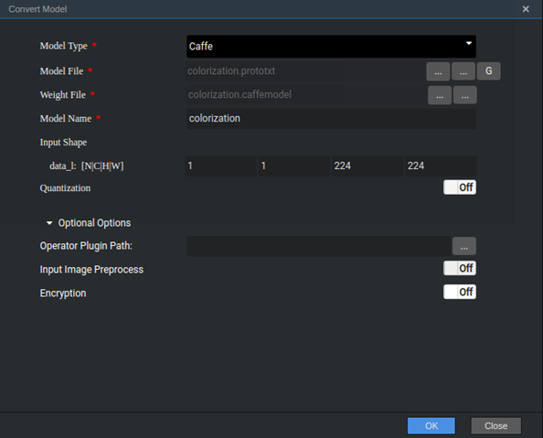

# 黑白图像上色（C++）

本Application支持运行在Atlas 200 DK上，实现了把黑白图像自动上色为彩色图像的效果。

当前分支中的应用适配**1.1.1.0**与**1.3.0.0**版本的[DDK&RunTime](https://ascend.huawei.com/resources)。

## 前提条件

部署此Sample前，需要准备好以下环境：

-   已完成Mind Studio的安装。
-   已完成Atlas 200 DK开发者板与Mind Studio的连接，交叉编译器的安装，SD卡的制作及基本信息的配置等。

## 软件准备

运行此Sample前，需要按照此章节获取源码包、准备模型文件并进行相关的环境配置。

1.  获取源码包。

    将[https://gitee.com/Atlas200DK/sample-colorization](https://gitee.com/Atlas200DK/sample-colorization)仓中的代码以Mind Studio安装用户下载至Mind Studio所在Ubuntu服务器的任意目录，例如代码存放路径为：$HOME/sample-colorization。

2.  获取此应用中所需要的原始网络模型。

    参考[表 黑白图像上色应用使用模型](#zh-cn_topic_0219383618_table1119094515272)获取此应用中所用到的原始网络模型及其对应的权重文件，并将其存放到Mind Studio所在Ubuntu服务器的任意目录，例如：$HOME/ascend/models/colorization。

    **表 1**  黑白图像上色应用使用模型

    
    <table><thead align="left"><tr id="zh-cn_topic_0219383618_row677354502719"><th class="cellrowborder" valign="top" width="12.85%" id="mcps1.2.4.1.1">
模型名称

    </th>
    <th class="cellrowborder" valign="top" width="12.57%" id="mcps1.2.4.1.2">
模型说明

    </th>
    <th class="cellrowborder" valign="top" width="74.58%" id="mcps1.2.4.1.3">
模型下载路径

    </th>
    </tr>
    </thead>
    <tbody><tr id="zh-cn_topic_0219383618_row3122314144215"><td class="cellrowborder" valign="top" width="12.85%" headers="mcps1.2.4.1.1 ">
colorization

    </td>
    <td class="cellrowborder" valign="top" width="12.57%" headers="mcps1.2.4.1.2 ">
黑白图像上色模型

    </td>
    <td class="cellrowborder" valign="top" width="74.58%" headers="mcps1.2.4.1.3 ">
请参考<a href="https://gitee.com/HuaweiAscend/models/tree/master/computer_vision/object_detect/colorization" target="_blank" rel="noopener noreferrer">https://gitee.com/HuaweiAscend/models/tree/master/computer_vision/object_detect/colorization</a>目录中README.md下载原始网络模型文件及其对应的权重文件。

    </td>
    </tr>
    </tbody>
    </table>

3.  将原始网络模型转换为适配昇腾AI处理器的模型。
    1.  在Mind Studio操作界面的顶部菜单栏中选择“Tool \> Convert Model”，进入模型转换界面。
    2.  在弹出的**Convert Model**操作界面中，Model File与Weight File分别选择[步骤2](#zh-cn_topic_0219383618_li29641938112018)中下载的模型文件和权重文件。
        -   **Model Name**填写为[表1](#zh-cn_topic_0219383618_table1119094515272)中对应的**模型名称**。
        -   Optional Options中的Input Image Preprocess关闭。
        -   其他参数保持默认值。

            **图 1**  配置示例  
            

    3.  单击OK开始转换模型。

        模型转换成功后，后缀为.om的离线模型存放地址为：$HOME/tools/che/model-zoo/my-model/colorization。

    4.  将转换好的模型文件（colorization.om）上传到[步骤1](#zh-cn_topic_0219383618_li953280133816)中源码所在路径的“sample-colorization/script”目录下。

4.  以Mind Studio安装用户登录Mind Studio所在Ubuntu服务器，并设置环境变量DDK\_HOME。

    **vim \~/.bashrc**

    执行如下命令在最后一行添加DDK\_HOME及LD\_LIBRARY\_PATH的环境变量。

    **export DDK\_HOME=$HOME/tools/che/ddk/ddk**

    **export LD\_LIBRARY\_PATH=$DDK\_HOME/uihost/lib**

    > **说明：**     
    >-   如果此环境变量已经添加，则此步骤可跳过。  

    输入:wq!保存退出。

    执行如下命令使环境变量生效。

    **source \~/.bashrc**

## 部署

1.  以Mind Studio安装用户进入通用分类网络应用代码所在根目录，如：$HOME/sample-colorization。
2.  执行部署脚本，进行工程环境准备，包括公共库的编译与部署、应用的编译与部署等操作。

    **bash deploy.sh  _host\_ip_**

    -   _host\_ip_：对于Atlas 200 DK开发者板，即为开发者板的IP地址。对于AI加速云服务器，即为Host的IP地址。

    命令示例：

    **bash deploy.sh 192.168.1.2**

3.  将需要推理的图片上传至Host侧任一属组为HwHiAiUser用户的目录，例如“/home/HwHiAiUser/pics“。

## 运行

1.  在Mind Studio所在Ubuntu服务器中，以HwHiAiUser用户SSH登录到Host侧。

    **ssh HwHiAiUser@**_host\_ip_

    对于Atlas 200 DK，host\_ip默认为192.168.1.2（USB连接）或者192.168.0.2（NIC连接）。

    对于AI加速云服务器，host\_ip即为当前Mind Studio所在服务器的IP地址。

2.  进入colorization的可执行文件所在路径。

    **cd \~/HIAI\_PROJECTS/ascend\_workspace/colorization/out**

3.  执行应用程序。

    执行**run\_colorization.py**脚本会将推理结果在执行终端直接打印显示。

    命令示例如下所示：

    **python3 run\_colorization.py -i \~/pics -o ./out**

    -   -i：输入图片的路径，可以是目录，表示当前目录下所有图片都作为输入；也可以指定具体图片。
    -   -o：上色后的图片保存路径。

## 依赖代码库下载

将依赖的软件库下载到“sample-colorization/script“目录下。

**表 2**  依赖代码库下载

<table><thead align="left"><tr id="zh-cn_topic_0219383618_row1335913343368"><th class="cellrowborder" valign="top" width="33.33333333333333%" id="mcps1.2.4.1.1">
模块名称

</th>
<th class="cellrowborder" valign="top" width="33.33333333333333%" id="mcps1.2.4.1.2">
模块描述

</th>
<th class="cellrowborder" valign="top" width="33.33333333333333%" id="mcps1.2.4.1.3">
下载地址

</th>
</tr>
</thead>
<tbody><tr id="zh-cn_topic_0219383618_row436033423616"><td class="cellrowborder" valign="top" width="33.33333333333333%" headers="mcps1.2.4.1.1 ">
EZDVPP

</td>
<td class="cellrowborder" valign="top" width="33.33333333333333%" headers="mcps1.2.4.1.2 ">
对DVPP接口进行了封装，提供对图片/视频的处理能力。

</td>
<td class="cellrowborder" valign="top" width="33.33333333333333%" headers="mcps1.2.4.1.3 ">
<a href="https://gitee.com/Atlas200DK/sdk-ezdvpp" target="_blank" rel="noopener noreferrer">https://gitee.com/Atlas200DK/sdk-ezdvpp</a>

下载后请保持文件夹名称为ezdvpp。

</td>
</tr>
</tbody>
</table>

