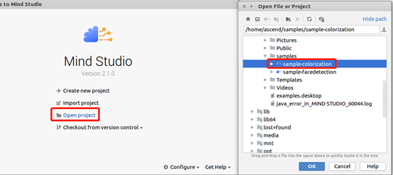
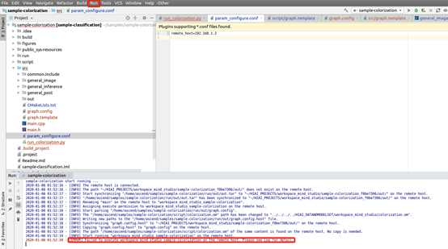

# 黑白图像上色<a name="ZH-CN_TOPIC_0219108795"></a>

本应用支持运行在Atlas 200 DK上，实现了对黑白图像自动上色的功能。

当前分支中的应用适配**1.31.0.0及以上**版本的[DDK&RunTime](https://ascend.huawei.com/resources)。

## 前提条件<a name="section137245294533"></a>

部署此Sample前，需要准备好以下环境：

-   已完成Mind Studio的安装。
-   已完成Atlas 200 DK开发者板与Mind Studio的连接，交叉编译器的安装，SD卡的制作及基本信息的配置等。

## 软件准备<a name="section181111827718"></a>

运行此Sample前，需要按照此章节获取源码包，并进行相关的环境配置。

1.  <a name="li953280133816"></a>获取源码包。

    将[https://gitee.com/Atlas200DK/sample-colorization/tree/1.3x.0.0/](https://gitee.com/Atlas200DK/sample-colorization/tree/1.3x.0.0/)仓中的代码以Mind Studio安装用户下载至Mind Studio所在Ubuntu服务器的任意目录，这两个文件必须存放到同一个目录下。例如代码存放路径为：$HOME/AscendProjects/sample-colorization。

2.  <a name="li2074865610364"></a>获取此应用中所需要的原始网络模型。

    参考[表 黑白图像上色应用使用模型](#table19942111763710)获取此应用中所用到的原始网络模型及其对应的权重文件，并将其存放到Mind Studio所在Ubuntu服务器的任意目录，这两个文件必须存放到同一个目录下。例如：$HOME/models/colorization。

    **表 1**  黑白图像上色应用使用模型

    <a name="table19942111763710"></a>
    <table><thead align="left"><tr id="row611318123710"><th class="cellrowborder" valign="top" width="11.959999999999999%" id="mcps1.2.4.1.1"><p id="p81141820376"><a name="p81141820376"></a><a name="p81141820376"></a>模型名称</p>
    </th>
    <th class="cellrowborder" valign="top" width="8.07%" id="mcps1.2.4.1.2"><p id="p13181823711"><a name="p13181823711"></a><a name="p13181823711"></a>模型说明</p>
    </th>
    <th class="cellrowborder" valign="top" width="79.97%" id="mcps1.2.4.1.3"><p id="p1717182378"><a name="p1717182378"></a><a name="p1717182378"></a>模型下载路径</p>
    </th>
    </tr>
    </thead>
    <tbody><tr id="row1119187377"><td class="cellrowborder" valign="top" width="11.959999999999999%" headers="mcps1.2.4.1.1 "><p id="p4745165253920"><a name="p4745165253920"></a><a name="p4745165253920"></a>colorization</p>
    </td>
    <td class="cellrowborder" valign="top" width="8.07%" headers="mcps1.2.4.1.2 "><p id="p1874515218391"><a name="p1874515218391"></a><a name="p1874515218391"></a>黑白图像上色模型</p>
    </td>
    <td class="cellrowborder" valign="top" width="79.97%" headers="mcps1.2.4.1.3 "><p id="p611318163718"><a name="p611318163718"></a><a name="p611318163718"></a>请参考<a href="https://gitee.com/HuaweiAscend/models/tree/master/computer_vision/object_detect/colorization" target="_blank" rel="noopener noreferrer">https://gitee.com/HuaweiAscend/models/tree/master/computer_vision/object_detect/colorization</a>目录中README.md下载原始网络模型文件及其对应的权重文件。</p>
    </td>
    </tr>
    </tbody>
    </table>

3.  以Mind Studio安装用户登录Mind Studio所在Ubuntu服务器，确定当前使用的DDK版本号并设置环境变量DDK\_HOME，tools\_version，NPU\_DEVICE\_LIB和LD\_LIBRARY\_PATH。
    1.  <a name="zh-cn_topic_0203223294_li61417158198"></a>查询当前使用的DDK版本号。

        可通过Mind Studio工具查询，也可以通过DDK软件包进行获取。

        -   使用Mind Studio工具查询。

            在Mind Studio工程界面依次选择“File \> Settings \> System Settings \> Ascend DDK“，弹出如[图 DDK版本号查询](zh-cn_topic_0203223294.md#fig94023140222)所示界面。

            **图 1**  DDK版本号查询<a name="zh-cn_topic_0203223294_fig17553193319118"></a>  
            

            其中显示的**DDK Version**就是当前使用的DDK版本号，如**1.31.T15.B150**。

        -   通过DDK软件包进行查询。

            通过安装的DDK的包名获取DDK的版本号。

            DDK包的包名格式为：**Ascend\_DDK-\{software version\}-\{interface version\}-x86\_64.ubuntu16.04.tar.gz**

            其中**software version**就是DDK的软件版本号。

            例如：

            DDK包的包名为Ascend\_DDK-1.31.T15.B150-1.1.1-x86\_64.ubuntu16.04.tar.gz，则此DDK的版本号为1.31.T15.B150。

    2.  设置环境变量。

        **vim \~/.bashrc**

        执行如下命令在最后一行添加DDK\_HOME及LD\_LIBRARY\_PATH的环境变量。

        **export tools\_version=_1.31.X.X_**

        **export DDK\_HOME=\\$HOME/.mindstudio/huawei/ddk/\\$tools\_version/ddk**

        **export NPU\_DEVICE\_LIB=$DDK\_HOME/../RC/host-aarch64\_Ubuntu16.04.3/lib**

        **export LD\_LIBRARY\_PATH=$DDK\_HOME/lib/x86\_64-linux-gcc5.4**

        > **说明：**   
        >-   **_1.31.X.X_**是[a](#zh-cn_topic_0203223294_li61417158198)中查询到的DDK版本号，需要根据查询结果对应填写，如**1.31.T15.B150**  
        >-   如果此环境变量已经添加，则此步骤可跳过。  

        输入**:wq!**保存退出。

        执行如下命令使环境变量生效。

        **source \~/.bashrc**

4.  将原始网络模型转换为适配昇腾AI处理器的模型。
    1.  在Mind Studio操作界面的顶部菜单栏中选择**Tool \> Convert Model**，进入模型转换界面。
    2.  在弹出的**Convert Model**操作界面中，进行模型转换配置。
        -   Model File选择[步骤2](#li2074865610364)中下载的模型文件，此时会自动匹配到权重文件并填写在Weight File中。
        -   Model Name填写为[表1](#table19942111763710)对应的**模型名称**：colorization。

            

        -   colorization模型输入shape为\(1,3,224,224\)，所以输入节点参数需要设置为1,3,224,224。

            

        -   模型输入为归一化的Lab图像的L通道数据，所以需要关闭aipp。

            

    3.  单击Finish开始转换模型。

        模型转换成功后，后缀为.om的离线模型存放地址为：$HOME/modelzoo/colorization/device。

        > **说明：**   
        >Mindstudio模型转换中每一步的具体意义和参数说明可以参考[Mind Studio用户手册](https://ascend.huawei.com/doc/mindstudio/)中的“模型转换“章节。  


5.  将转换好的模型文件（.om文件）上传到[步骤1](#li953280133816)中源码所在路径下的“**sample\_colorization/script**”目录下。

## 编译<a name="section3723145213347"></a>

1.  打开对应的工程。

    以Mind Studio安装用户在命令行中进入安装包解压后的“MindStudio-ubuntu/bin”目录，如$HOME/MindStudio-ubuntu/bin。执行如下命令启动Mind Studio。

    **./MindStudio.sh**

    启动成功后，打开**sample\_colorization**工程，如[图 打开sample\_colorization工程](#fig05481157171918)所示。

    **图 2**  打开sample\_colorization工程<a name="fig05481157171918"></a>  
    

    

2.  在**src/param\_configure.conf**文件中配置相关工程信息。

    **图 3**  配置文件路径<a name="fig0391184062214"></a>  
    

    该配置文件内容如下：

    ```
    remote_host=
    ```

    需要手动添加参数配置：

    remote\_host：Atlas 200 DK开发者板的IP地址。

    配置示例：

    ```
    remote_host=192.168.1.2
    ```

    > **说明：**   
    >-   注意参数填写时不需要使用“”符号。  

3.  开始编译，打开Mindstudio工具，在工具栏中点击**Build \> Build \> Build-Configuration**。会在目录下生成build和run文件夹。

    注意：

    首次编译工程时，**Build \> Build**为灰色不可点击状态。需要点击**Build \> Edit Build Configuration**，配置编译参数后再进行编译。

    

4.  将需要上色的图片上传至Host侧任一属组为HwHiAiUser用户的目录。

## 运行<a name="section1620073406"></a>

1.  在Mindstudio工具的工具栏中找到Run按钮，点击  **Run \> Run 'sample-colorization’**，如[图 程序已执行示意图](#fig18918132273612)所示，可执行程序已经在开发板执行。

    **图 4**  程序已执行示意图<a name="fig18918132273612"></a>  
    

    以上报错信息请忽略，因为Mind Studio无法为可执行程序传参，上述步骤是将可执行程序与依赖的库文件部署到开发者板，此步骤需要ssh登录到开发者板至相应的目录文件下手动执行，具体请参考以下步骤。

2.  在Mind Studio所在Ubuntu服务器中，以HwHiAiUser用户SSH登录到Host侧。

    **ssh HwHiAiUser@**_host\_ip_

    对于Atlas 200 DK，host\_ip默认为192.168.1.2（USB连接）或者192.168.0.2（NIC连接）。

3.  进入黑白图像上色应用的可执行文件所在路径。

    命令举例如下：

    **cd \~/HIAI\_PROJECTS/workspace\_mind\_studio/sample-colorization\_xxx/out**

4.  执行应用程序。

    执行**run\_colorization.py**脚本会将推理生成的图片保存至指定路径。

    命令示例如下所示：

    **python3 run\_colorization.py -i \~/example.jpg -o ./out/**

    -   -i：输入图片的路径，可以是目录，表示当前目录下所有图片都作为输入；也可以指定具体图片。
    -   -o：上色后的图片保存路径


